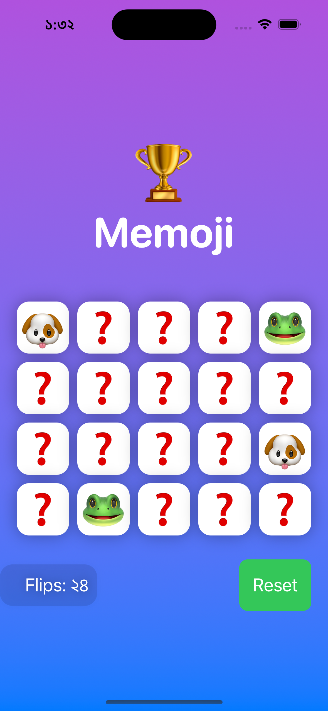

# Memoji Game

A fun, emoji-themed memory game built with SwiftUI. In this game, players flip cards to find matching emoji pairs. Match all pairs to win the game!

## Features

- **Animated Card Flip**: Smooth animations for card flipping using SwiftUI.
- **Gradient Background**: Full-screen gradient background for a vibrant and modern look.
- **Emoji Match Logic**: Game logic to track flipped and matched cards.
- **Win Alert**: A congratulatory alert when all pairs are matched.
- **Flip Counter**: Keeps track of the number of flips made by the player.
- **Reset Button**: Restart the game anytime with shuffled cards and reset stats.

## Screenshots

| Home Screen | 
|-------------|
||


## Code Overview

### `ContentView` Structure

- **State Variables**:
  - `emojis`: Array of emojis for the game, which shuffles on reset.
  - `flippedIndices`: Tracks flipped cards.
  - `matchedIndices`: Tracks matched card indices.
  - `showWinAlert`: Boolean to display a win alert.
  - `numFlips`: Counter for the number of flips.

- **UI Layout**:
  - **Gradient Background**: Purple to blue gradient that spans the entire screen.
  - **Emoji Grid**: 4x5 grid with `LazyVGrid` to display emoji cards.
  - **Footer**: Displays the flip counter and reset button.

### Game Functions

- **flipCard(at:)**: Flips a card and updates `numFlips`. If two cards are flipped, calls `checkForMatch`.
- **checkForMatch**: Checks if the flipped cards match. If they do, they are added to `matchedIndices`. When all pairs are matched, `showWinAlert` is set to `true`.
- **resetGame**: Reshuffles emojis and resets all game variables.

### Styling

- **Card Styling**: White cards with rounded corners and a shadow effect.
- **Flip Counter Styling**: Styled with a subtle background, shadow, and padding for better readability.

## Getting Started

1. **Clone the Repository**:
   ```bash
   git clone https://github.com/your-username/memoji-game.git
   cd memoji-game
   ```

2. **Open the Project**:
   Open `MemojiGame.xcodeproj` in Xcode.

3. **Run the App**:
   Select a simulator or device and hit the "Run" button in Xcode.

## Requirements

- Xcode 12 or later
- SwiftUI-compatible iOS version

## Customization

- **Change Emojis**: Modify the `emojis` array in `ContentView` to customize the game's emoji set.
- **Grid Size**: Adjust the number of `GridItem`s in `LazyVGrid` to change the grid layout.

## License

This project is licensed under the MIT License.
```
